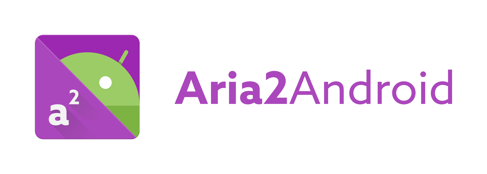

<h1 align=center>

</h1>

An Android app that lets you run [aria2](https://github.com/aria2/aria2) on your device.

## Setup
This project uses [devgianlu/CommonUtils](https://github.com/devgianlu/CommonUtils), please follow the link to setup your environment properly.

## Logo design
The logo has been renewed by [@zularizal](https://github.com/zularizal), see [#7](https://github.com/devgianlu/Aria2Android/issues/7).
